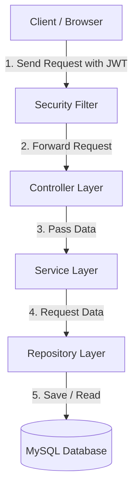
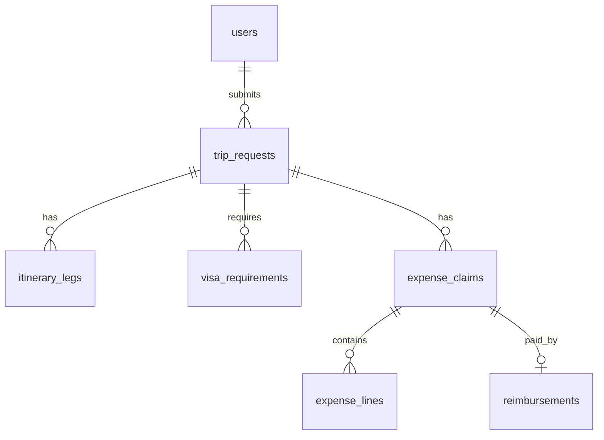

# JourneyPlus - Software Architecture Document

This document explains how the JourneyPlus application is designed. It is written in simple language and is easy to understand.

---

## Table of Contents
1. [Project Overview](#1-project-overview)
2. [Architecture Overview](#2-architecture-overview)
3. [Technology Stack](#3-technology-stack)
4. [Project Structure](#4-project-structure)
5. [Layer Architecture](#5-layer-architecture)
6. [Request Flow](#6-request-flow)
7. [Security Architecture](#7-security-architecture)
8. [Database Architecture](#8-database-architecture)
9. [Modules](#9-modules)
10. [Design Patterns](#10-design-patterns)
11. [Deployment](#11-deployment)
12. [Summary](#12-summary)

---

## 1. Project Overview

### What is the project?
* **JourneyPlus** is a backend application for managing corporate travel and expenses.
* It helps companies track employee trips, manage cash advances, and handle expense claims.

### Why was it built?
* In many companies, employees submit travel requests and receipts manually via email or paper.
* This manual process is slow, leads to errors, and makes it hard to enforce budget limits.
* JourneyPlus was built to automate these workflows and make them faster and more secure.

### What problem does it solve?
* **Saves Time**: Automates approval workflows for trips, cash advances, and expenses.
* **Enforces Policies**: Automatically checks if an expense exceeds the budget limit before it is approved.
* **Secures Data**: Encrypts sensitive financial amounts in the database.

---

## 2. Architecture Overview

JourneyPlus uses a **Layered Architecture**. The application is divided into different layers, and each layer has a specific job.



* The **Client** sends a request with a security token (JWT).
* The **Security Filter** verifies the token.
* The **Controller** receives the request and validates the input.
* The **Service** contains the business rules and performs calculations.
* The **Repository** communicates with the **Database** to save or retrieve data.

---

## 3. Technology Stack

Here are the main technologies used in this project:

### Java (Version 21)
* **What it is**: The programming language used to write the backend code.
* **Why we use it**: It is reliable, fast, and supports modern features like virtual threads.

### Spring Boot (Version 3.2.5)
* **What it is**: A framework that makes it easy to build Java web applications.
* **Why we use it**: It configures the application automatically and includes an embedded web server.

### Spring MVC
* **What it is**: The part of Spring used to build REST APIs.
* **Why we use it**: It maps incoming HTTP requests directly to Java methods.

### Spring Data JPA
* **What it is**: A tool that simplifies database operations.
* **Why we use it**: It allows us to write database queries using simple Java methods instead of complex SQL.

### Hibernate
* **What it is**: An Object-Relational Mapping (ORM) tool.
* **Why we use it**: It automatically maps Java classes (Entities) to MySQL database tables.

### Spring Security
* **What it is**: A security framework for Spring applications.
* **Why we use it**: It secures our endpoints and manages user roles and permissions.

### JWT (JSON Web Token)
* **What it is**: A secure way to represent user identity as a token.
* **Why we use it**: It allows stateless authentication using asymmetric RSA public/private keys.

### MySQL
* **What it is**: A relational database.
* **Why we use it**: It is reliable, widely used, and stores data in structured tables.

### Maven
* **What it is**: A build and dependency management tool.
* **Why we use it**: It downloads all required libraries automatically and compiles the project.

### Swagger (OpenAPI)
* **What it is**: A tool that generates API documentation.
* **Why we use it**: It provides a web page where developers can view and test all REST endpoints.

### Lombok
* **What it is**: A library that reduces boilerplate code.
* **Why we use it**: It generates getters, setters, and constructors automatically using simple annotations.

---

## 4. Project Structure

The project is organized into the following packages under `com.journeyplus`:

* **`config`**: Contains configuration files (e.g., Security, Swagger, and AOP logging setup).
* **`controller`**: Contains the REST controllers that expose the API endpoints.
* **`service`**: Contains the business logic and calculations.
* **`repository`**: Contains the database access interfaces.
* **`entity`**: Contains the Java classes that represent database tables.
* **`dto`**: Contains data transfer objects used for API requests and responses.
* **`exception`**: Contains classes that handle errors and return clean error messages.
* **`notification`**: Contains classes that manage user alerts.
* **`audit`**: Contains classes that log system operations.
* **`util`**: Contains utility classes (e.g., AES encryption utilities).

---

## 5. Layer Architecture

The application is split into four main layers:

```text
[ Controller Layer ]  <-- Exposes APIs & Validates Input
        ↓
[   Service Layer  ]  <-- Executes Business Logic & Rules
        ↓
[ Repository Layer ]  <-- Interacts with the Database
        ↓
[  Database Layer  ]  <-- Stores the Data in Tables
```

### 1. Controller Layer
* **Responsibility**: Receives HTTP requests, validates input data, and returns HTTP responses.
* **Key Classes**: `AuthController`, `TripController`, `ExpenseController`.
* **Communication**: Receives requests from the client and calls the Service Layer.

### 2. Service Layer
* **Responsibility**: Implements business rules (e.g., checking budget limits or converting currencies).
* **Key Classes**: `AuthService`, `TripService`, `ExpenseService`, `PolicyComplianceEngine`.
* **Communication**: Called by the Controller Layer and calls the Repository Layer.

### 3. Repository Layer
* **Responsibility**: Fetches and saves data from the database using Spring Data JPA.
* **Key Classes**: `UserRepository`, `TripRequestRepository`, `ExpenseClaimRepository`.
* **Communication**: Called by the Service Layer and communicates with the Database.

### 4. Database Layer
* **Responsibility**: Stores the data in physical tables.
* **Key Classes**: `User` entity, `TripRequest` entity, `ExpenseLine` entity.

---

## 6. Request Flow

Here is what happens when an employee submits a new trip request:

1. **Client Request**: The employee clicks "Submit" in the frontend. The browser sends a `POST` request to `/api/trips/{id}/submit` with a JWT token.
2. **Security Check**: The `JwtAuthenticationFilter` validates the JWT token using the RSA Public Key.
3. **Controller**: The `TripController` receives the request and calls `TripService.submitTripRequest(id)`.
4. **Service**: The `TripService` checks if the trip status is `DRAFT`. It changes the status to `SUBMITTED`.
5. **Repository**: The service calls `TripRequestRepository.save()`.
6. **Database**: Hibernate converts the trip entity into a SQL `UPDATE` statement and saves it in the `trip_requests` table.
7. **Response**: The database confirms the save. The service publishes a notification event, and the controller returns the updated trip details to the client as a JSON response.

---

## 7. Security Architecture

### Spring Security
* Secures the application by restricting endpoint access.
* Public paths like `/api/auth/**` are open to everyone.
* Protected paths like `/api/admin/**` require specific roles.

### Login Process
* The client sends a username and password.
* The system loads the user from the database and verifies the password using BCrypt.
* If correct, the system generates a JWT token signed with an RSA Private Key.

### JWT (Access & Refresh Tokens)
* **Access Token**: A short-lived token (e.g., 1 hour) used to access protected APIs.
* **Refresh Token**: A longer-lived token used to get a new access token when it expires.

### Password Encryption
* Passwords are never stored in plain text.
* The system uses **BCrypt** to hash passwords before saving them.

### Role-based Authorization
* Users are assigned roles (e.g., `ROLE_EMPLOYEE`, `ROLE_APPROVING_MANAGER`).
* The system checks these roles before letting a user access an endpoint.

---

## 8. Database Architecture

The database stores data in tables. Relations are managed using foreign keys.



* **`users`**: Stores employee and manager profiles.
* **`trip_requests`**: Stores trip details. Links to `users` via `employee_id`.
* **`itinerary_legs`**: Stores travel segments (flights, trains). Links to `trip_requests`.
* **`visa_requirements`**: Stores visa requirements. Links to `trip_requests`.
* **`expense_claims`**: Stores expense claims. Links to `users` and `trip_requests`.
* **`expense_lines`**: Stores individual receipts. Links to `expense_claims`.
* **`reimbursements`**: Stores payment records. Links to `expense_claims`.

---

## 9. Modules

* **Authentication**: Handles user registration, login, and token generation.
* **User Management**: Manages user profiles and admin approvals.
* **Travel**: Manages trip drafts, submissions, itinerary legs, and visa checks.
* **Policy**: Defines budget limits per role and daily allowance limits per city.
* **Expense**: Manages expense claims, converts foreign currencies, and tracks payouts.
* **Approval**: Coordinates manager reviews for trips, advances, and expenses.
* **Notification**: Generates in-app alerts for status updates.
* **Audit**: Automatically logs critical actions in the database using AOP.

---

## 10. Design Patterns

### Repository Pattern
* **What it is**: Hides database logic behind clean Java interfaces.
* **Where it is used**: All interfaces extending `JpaRepository` (e.g., `UserRepository`).

### Service Layer Pattern
* **What it is**: Groups all business logic in one place.
* **Where it is used**: Classes in the `service` package (e.g., `ExpenseService`).

### DTO (Data Transfer Object) Pattern
* **What it is**: Simple classes used to send data over the network.
* **Where it is used**: Classes like `RegisterRequest` and `AuthResponse`.

### Dependency Injection
* **What it is**: The system automatically provides dependencies to classes instead of making the classes create them.
* **Where it is used**: Configured using `@Autowired` or constructor injection throughout the application.

---

## 11. Deployment

### How the application starts
* The project compiles into a single `.jar` file.
* Running `java -jar application.jar` starts the application.

### Embedded Tomcat
* Spring Boot includes an embedded **Tomcat** web server.
* You do not need to install a separate web server to run the application.

### Database Connection
* Configured in [application.properties](file:///c:/Users/venky/OneDrive/Desktop/finall-Backend/final%20backend/Testing_4_Modules/src/main/resources/application.properties).
* Defines the database URL, username, and password.

### Swagger URL
* Once the application is running, you can view the API documentation at:
  `http://localhost:8080/swagger-ui.html`

---

## 12. Summary

* **Architecture**: A clean, layered architecture that separates controllers, services, and repositories.
* **Security**: Uses BCrypt for password hashing, RSA-signed JWTs for authentication, and AES-256 for encrypting financial data at rest.
* **Database**: Mapped using Hibernate and MySQL with relationships between tables.
* **Maintainability**: Easy to maintain because each class has a single responsibility.
* **Future Improvements**:
  * Add Redis to cache policies and city tiers.
  * Add Docker support for easy deployment.
  * Add a message broker (like RabbitMQ) for asynchronous notifications.
