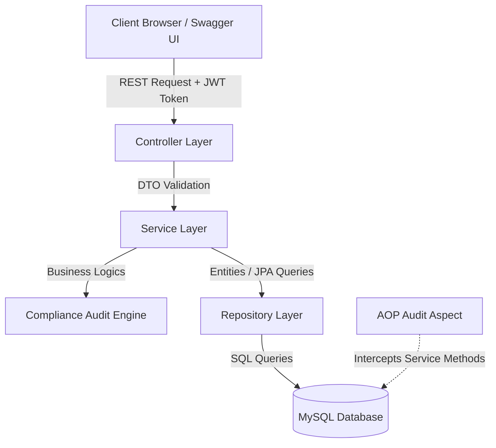
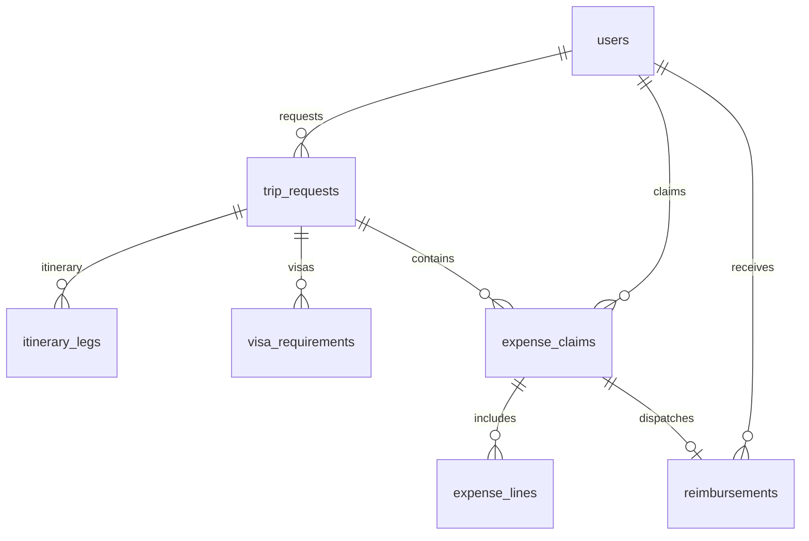
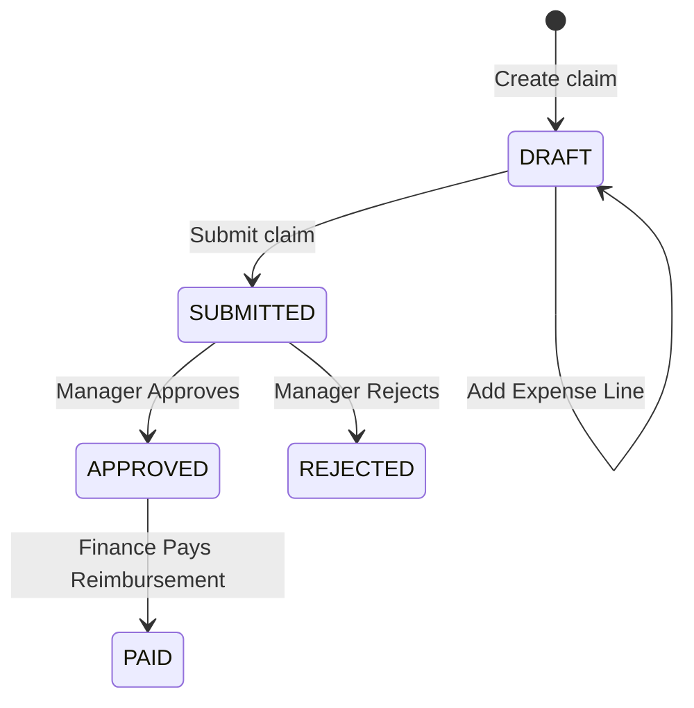
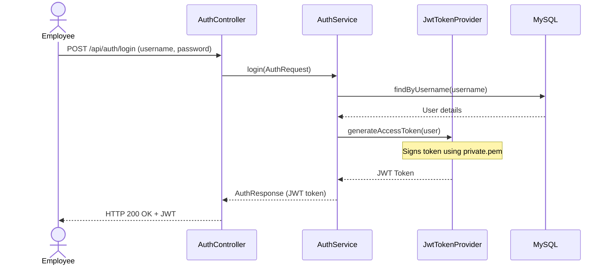

# JourneyPlus - Corporate Travel and Expense Management System

## Table of Contents
1. [Project Overview](#1-project-overview)
2. [System Architecture](#2-system-architecture)
3. [Technology Stack](#3-technology-stack)
4. [Project Structure](#4-project-structure)
5. [Database Design](#5-database-design)
6. [Entity Explanation](#6-entity-explanation)
7. [API Documentation](#7-api-documentation)
8. [Service Layer Explanation](#8-service-layer-explanation)
9. [Repository Layer](#9-repository-layer)
10. [Security Implementation](#10-security-implementation)
11. [Exception Handling](#11-exception-handling)# Prompt: Generate a Simple and Easy-to-Understand API Documentation

Analyze my complete Spring Boot project and generate an **API Documentation** in **Markdown (.md)** format.

The output file should be:

`docs/05-API-Documentation.md`

Generate the document only from the actual source code. Do not assume APIs that are not implemented.

---

# Writing Style

* Use simple English.
* Write short and clear sentences.
* Avoid complicated technical words.
* Explain every API so that a beginner can understand.
* Use tables wherever possible.
* Keep paragraphs short.
* Make the document suitable for college submission, mentor review, GitHub documentation, and interview preparation.

---

# Document Structure

## 1. Document Information

Include:

* Document Title
* Project Name
* Version
* Author
* Date
* Purpose of the Document

---

## 2. Table of Contents

Generate a clickable Markdown table of contents.

---

## 3. Introduction

Explain:

* What is an API?
* Why this project uses REST APIs?
* How clients communicate with the backend.
* Response format used (JSON).

Keep the explanation simple.

---

## 4. API Overview

Explain:

* Base URL
* API Version
* Request Format
* Response Format
* Authentication Method
* Content Type

Example table:

| Property        | Value |
| --------------- | ----- |
| Base URL        | /api  |
| Authentication  | JWT   |
| Request Format  | JSON  |
| Response Format | JSON  |

Use the actual values from the project.

---

## 5. Authentication

Explain:

* JWT Authentication
* Access Token
* Refresh Token
* Authorization Header

Example:

Authorization: Bearer <access_token>

Explain how protected APIs are accessed.

---

## 6. Common HTTP Status Codes

Create a table.

Example:

| Code | Meaning               |
| ---- | --------------------- |
| 200  | Success               |
| 201  | Created               |
| 400  | Bad Request           |
| 401  | Unauthorized          |
| 403  | Forbidden             |
| 404  | Not Found             |
| 500  | Internal Server Error |

Only include status codes actually returned by the project.

---

## 7. Common Response Format

Explain the standard response structure used by the project.

Include examples of:

* Success Response
* Error Response
* Validation Error Response

Use actual examples from the code.

---

## 8. API Modules

Group APIs by module.

Examples:

* Authentication
* User Management
* Travel
* Policy
* Expense
* Approval
* Notification
* Audit

For every module, provide a short introduction.

---

# 9. Endpoint Documentation

For **every controller** and **every API endpoint**, generate a section with the following details.

### Endpoint Name

### HTTP Method

(GET / POST / PUT / DELETE / PATCH)

### URL

Example:

`POST /api/auth/login`

### Description

Explain what the API does.

### Access Role

Mention which roles can access it.

### Authentication Required

Yes / No

### Request Headers

Example:

Authorization: Bearer Token

Content-Type: application/json

### Path Parameters

Create a table if applicable.

| Name | Type | Description |

### Query Parameters

Create a table if applicable.

| Name | Type | Required | Description |

### Request Body

Generate the JSON request using the actual DTO.

Explain each field in a table.

| Field | Type | Required | Description |

### Success Response

Generate the actual JSON response.

Explain every response field.

### Error Responses

List possible errors.

Example:

400 Bad Request

401 Unauthorized

403 Forbidden

404 Not Found

500 Internal Server Error

Only include errors actually handled by the project.

---

Repeat this format for every endpoint found in the project.

---

## 10. API Flow

Explain how an API request travels through the application.

Example:

Client

↓

Controller

↓

Service

↓

Repository

↓

Database

↓

Repository

↓

Service

↓

Controller

↓

Client

Explain each step briefly.

---

## 11. Validation Rules

For every request DTO explain:

* Required fields
* @NotNull
* @NotBlank
* @Size
* @Email
* @Min
* @Max

Generate a table.

---

## 12. Security

Explain:

* JWT Validation
* Access Token
* Refresh Token
* Password Encryption
* Role-Based Authorization
* Protected Endpoints
* Public Endpoints

Keep the explanation simple.

---

## 13. Swagger

Explain:

* Swagger URL
* OpenAPI Documentation
* How to test APIs using Swagger

Use the actual project configuration.

---

## 14. Error Handling

Explain:

* Global Exception Handler
* Validation Errors
* Authentication Errors
* Authorization Errors

Include sample error responses.

---

## 15. API Testing

Explain how to test the APIs using:

* Swagger UI
* Postman

Describe the login process and how to use the JWT token for protected APIs.

---

## 16. Best Practices

Mention the practices followed in the project.

Examples:

* RESTful URLs
* Proper HTTP methods
* DTO usage
* Input validation
* JWT Authentication
* Role-Based Access
* Meaningful status codes

Only include practices actually used.

---

## 17. Summary

Write a short conclusion describing:

* API organization
* Security
* Ease of use
* Maintainability

---

# Output Requirements

* Generate valid Markdown.
* Use simple English.
* Explain every endpoint found in the project.
* Generate request and response JSON from the actual DTOs and controllers.
* Include all controllers.
* Include all request mappings.
* Include all roles and authorization rules.
* Use tables wherever helpful.
* Keep explanations short and easy to understand.
* Do not invent APIs or fields that are not present in the source code.
* The documentation should be suitable for GitHub, mentor review, team members, and interview preparation.

12. [Validation Rules](#12-validation-rules)
13. [Expense Management Workflow](#13-expense-management-workflow)
14. [Test Case Documentation](#14-test-case-documentation)
15. [Sequence Diagrams](#15-sequence-diagrams)
16. [Design Patterns Used](#16-design-patterns-used)
17. [Setup and Installation Guide](#17-setup-and-installation-guide)
18. [Build and Run Commands](#18-build-and-run-commands)
19. [Future Enhancements](#19-future-enhancements)
20. [Conclusion](#20-conclusion)

---

## 1. Project Overview

* **Project Name**: JourneyPlus (Corporate Travel and Expense Management Backend)
* **Purpose**: To provide a unified backend system for corporate travel planning, policy compliance auditing, automated visa verification, cash advance processing, and expense reimbursement management.
* **Problem Statement**: Corporate travel is often fragmented. Travel requests, policy guidelines, and expense claim flows are handled across siloed emails, spreadsheets, or physical forms, leading to compliance failures, manual error, and delay in reimbursement cycles.
* **Business Objective**:
  - Streamline employee travel request submission, approval workflows, and booking updates.
  - Automatically enforce travel policy rules (limits per role, city tier daily allowances) to prevent over-budget claims before they are submitted.
  - Provide secure audit tracking and expense line encryption.
  - Ensure fast reimbursement cycles via automated approvals and payouts.
* **Scope of the Project**:
  - Identity & Access Management (User approvals, custom roles).
  - Travel Policy Enforcement (City tiers, daily allowances).
  - Trip Booking & Itinerary Management (Multi-leg tracking, visa requirements).
  - Cash Advance Requests (Advance limits, disbursements).
  - Expense Reimbursements (Multi-currency translation to USD, compliance checks, manager reviews, paid disbursements).
* **Key Features**:
  - Asymmetric RSA JWT signing and validation.
  - Custom Java AOP (Aspect-Oriented Programming) audit logger storing operations in database records.
  - Database AES-256 encryption on financial columns (amounts, allowances) using a custom JPA Attribute Converter.
  - Rule-based Automated compliance engine for expense lines.

---

## 2. System Architecture

The project is built using a classic **layered (n-tier) architecture** to separate concerns:



### Flow of Execution
1. **Request Reception**: Clients send HTTP requests containing JSON payloads and an authorization header with a JWT token.
2. **Security & Validation Layer**: `JwtAuthenticationFilter` intercepts requests to validate token signatures using RSA public keys. If valid, security contexts are established. Spring Validation annotations (`@Valid`) validate input constraints.
3. **Controller Layer**: Decouples API endpoints, parses parameters, and delegates executions to Services.
4. **Service Layer**: Handles transactional business logic. Invokes external engines (like the Policy Compliance Engine) and publishes status events via Spring's `ApplicationEventPublisher`.
5. **AOP Audit Layer**: Intercepts methods marked with `@AuditAction` and writes log entries to the `audit_logs` table asynchronously or transactionally.
6. **Repository Layer (JPA)**: Abstracts raw SQL. Encodes financial data using an `AttributeConverter` before writing it to MySQL.

---

## 3. Technology Stack

| Technology | Version | Purpose | Why Chosen |
| :--- | :--- | :--- | :--- |
| **Java** | 21 | Core Language Runtime | Long-Term Support (LTS) release providing modern switch expressions, records, virtual threads, and garbage collector improvements. |
| **Spring Boot** | 3.2.5 | Core Framework | Simplifies configurations, offers built-in Tomcat server, Spring Security, and powerful dependency injection container. |
| **Spring Security**| 6.2.4 | Authentication & Auth | Configures enterprise-grade security filters, CORS rules, and secure endpoint access mappings. |
| **JJWT (io.jsonwebtoken)**| 0.12.5 | JWT Tokens | Modern library for reading, validating, and generating asymmetric RSA signed tokens. |
| **MySQL** | 8.0+ | Relational Database | High reliability, ACID transaction support, index optimization, and compatibility with JPA. |
| **Hibernate (JPA)** | 6.4.4 | ORM Mapping | Automates mapping between Java classes and database schemas, reducing SQL boilerplate code. |
| **Maven** | 3.9+ | Build Automation | Handles project dependency tree, plugin executions, compilation, and test cycles. |
| **Lombok** | latest | Code generation | Eliminates manual getter/setter boilerplate code to keep Java entity classes readable. |
| **JUnit Jupiter** | 5.10.2 | Testing Framework | Standard library for structuring unit and integration assertions. |
| **Mockito** | 5.7.0 | Mocks & Spies | Facilitates isolated unit testing by mocking repositories and event publishers. |

---

## 4. Project Structure

```text
src/main/java/com/journeyplus
├── JourneyPlusApplication.java
├── advance
│   ├── controller      # Endpoints for advance cash requests
│   ├── entity          # Domain entities: AdvanceRequest, AdvanceSettlement, AdvanceStatus
│   ├── repository      # JPA DB operations: AdvanceRequestRepository, AdvanceSettlementRepository
│   └── service         # Core business logic: AdvanceService
├── analytics
│   ├── controller      # Endpoints for report exports
│   ├── entity          # Domain entities: TravelReport
│   ├── repository      # JPA repositories for report records
│   └── service         # Logic for compiling travel and financial reports
├── audit
│   ├── controller      # Audit log endpoints for administrators
│   ├── entity          # Domain entity: AuditLog
│   └── repository      # DB operations: AuditLogRepository
├── common
│   ├── CryptoUtils.java                 # AES encryption engine
│   ├── EncryptedBigDecimalConverter.java # JPA converter for encrypting DB fields
│   ├── GlobalExceptionHandler.java      # ControllerAdvice for centralized error handling
│   └── controller
│       └── RestExceptionHandler.java    # Fallback REST API exception handler
├── compliance
│   ├── controller      # Compliance rule checks endpoints
│   ├── entity          # Domain entities: ComplianceAudit, PolicyException
│   ├── repository      # DB operations: ComplianceAuditRepository, PolicyExceptionRepository
│   └── service         # Business rules compiler: PolicyComplianceEngine
├── config
│   ├── AuditAction.java                 # Custom auditing annotation
│   ├── AuditAspect.java                 # Spring AOP aspect intercepting actions
│   ├── DataLoader.java                  # Initial database seed configurations
│   ├── JwtAuthenticationFilter.java     # Secure request filter chain
│   ├── JwtTokenProvider.java            # Cryptographic token generator
│   ├── OpenApiConfig.java               # Swagger document setups
│   ├── RSAKeyConfig.java                # RSA key pair loader
│   ├── SecurityConfig.java              # Spring Security settings
│   └── SwaggerSecurityConfig.java       # Swagger authorizations configuration
├── document
│   ├── controller      # Document upload and download endpoints
│   ├── entity          # Document metadata record
│   ├── repository      # Document database repository
│   ├── service         # Storage service delegator
│   └── storage         # File storage managers (LocalStorageService)
├── event
│   ├── StatusChangeEvent.java           # Custom spring event definition
│   └── StatusChangeEventListener.java   # Event listener delivering alerts
├── expense
│   ├── controller      # Expense claims and reimbursement endpoints
│   ├── entity          # Domain entities: ExpenseClaim, ExpenseLine, Reimbursement, ExpenseStatus
│   ├── repository      # JPA repositories for claims, lines, and reimbursements
│   └── service         # Core logic: ExpenseService
├── iam
│   ├── controller      # Authentication and admin user management endpoints
│   ├── dto             # DTO payloads: AuthRequest, AuthResponse, RegisterRequest
│   ├── entity          # Domain entities: User, Role
│   ├── repository      # UserRepository
│   └── service         # Core business logics: AuthService, UserService
├── notification
│   ├── controller      # User notification endpoints
│   ├── entity          # Domain entity: Notification
│   └── repository      # DB operations: NotificationRepository
├── policy
│   ├── controller      # Custom policy configuration endpoints
│   ├── entity          # Domain entities: TravelPolicy, CityTier
│   ├── repository      # DB operations: TravelPolicyRepository, CityTierRepository
│   └── service         # Core logic: PolicyService
└── trip
    ├── controller      # Trip bookings and request endpoints
    ├── dto             # Travel input payloads
    ├── entity          # Domain entities: ItineraryLeg, TripRequest, TripStatus, VisaRequirement
    ├── repository      # JPA repositories: TripRequestRepository, ItineraryLegRepository
    └── service         # Core logic: TripService
```

---

## 5. Database Design

JourneyPlus database features relations to handle security, audit logs, trip request definitions, expense claims, cash advances, and policies.



### Table Schema Mappings

#### 1. `users`
- `id` (BIGINT, Primary Key, Auto-Increment)
- `username` (VARCHAR(100), Unique, Not Null)
- `email` (VARCHAR(150), Unique, Not Null)
- `password_hash` (VARCHAR(255), Not Null)
- `role` (VARCHAR(50), Not Null)
- `department` (VARCHAR(100), Not Null)
- `active` (BOOLEAN, Default True)
- `created_at` (TIMESTAMP)
- `updated_at` (TIMESTAMP)

#### 2. `trip_requests`
- `id` (BIGINT, Primary Key, Auto-Increment)
- `employee_id` (BIGINT, Foreign Key -> `users.id`)
- `purpose` (VARCHAR(255), Not Null)
- `destination` (VARCHAR(150), Not Null)
- `start_date` (DATE, Not Null)
- `end_date` (DATE, Not Null)
- `status` (VARCHAR(50), Not Null)
- `comments` (TEXT)
- `approving_manager_id` (BIGINT, Foreign Key -> `users.id`)

#### 3. `expense_claims`
- `id` (BIGINT, Primary Key, Auto-Increment)
- `trip_request_id` (BIGINT, Foreign Key -> `trip_requests.id`)
- `employee_id` (BIGINT, Foreign Key -> `users.id`)
- `claim_title` (VARCHAR(200), Not Null)
- `submitted_date` (DATE)
- `total_amount` (VARCHAR(255), Encrypted, Not Null)
- `original_currency` (VARCHAR(10), Not Null)
- `usd_equivalent` (VARCHAR(255), Encrypted, Not Null)
- `status` (VARCHAR(50), Not Null)
- `manager_comments` (TEXT)

#### 4. `expense_lines`
- `id` (BIGINT, Primary Key, Auto-Increment)
- `expense_claim_id` (BIGINT, Foreign Key -> `expense_claims.id`)
- `expense_date` (DATE, Not Null)
- `category` (VARCHAR(50), Not Null)
- `amount` (VARCHAR(255), Encrypted, Not Null)
- `original_currency` (VARCHAR(10), Not Null)
- `usd_equivalent` (VARCHAR(255), Encrypted, Not Null)
- `receipt_path` (VARCHAR(255))
- `policy_compliance_status` (VARCHAR(50), Not Null)
- `compliance_remarks` (TEXT)

---

## 6. Entity Explanation

Every entity class maps directly to a MySQL database table. Cryptographic fields are intercepted and converted transparently.

### 1. `User` (com.journeyplus.iam.entity)
- **Purpose**: Represents corporate employees and administrators.
- **Security Role**: Implements Spring Security's `UserDetails` contract.
- **Constraints**:
  - `username` and `email` must be unique.
  - Active check is used to implement account approval locks.

### 2. `TravelPolicy` (com.journeyplus.policy.entity)
- **Purpose**: Defines budget limitations for specific role categories.
- **Properties**:
  - `employeeRole` (Role enum, unique index): E.g., `EMPLOYEE`, `APPROVING_MANAGER`.
  - `maxAmountPerTrip` (Encrypted BigDecimal): Limits the maximum allowed cost per booking.
  - `requiresVisaVerification` (Boolean): Defines if visa verification check is enforced.

### 3. `CityTier` (com.journeyplus.policy.entity)
- **Purpose**: Categorizes cities into tiers (`TIER_1`, `TIER_2`, `TIER_3`) to enforce allowance limits.
- **Properties**:
  - `cityName` (Unique, case-insensitive).
  - `dailyAllowanceLimit` (Encrypted BigDecimal): Maximum allowed cost per day in this city.

---

## 7. API Documentation

### API Reference Directory

Below is the complete catalog of all API endpoints exposed by the JourneyPlus platform, grouped by system domain and specifying HTTP Method, path variables, user roles permitted by security, and their primary function.

| Module | HTTP Method | API Path | Role Access | Purpose |
| :--- | :--- | :--- | :--- | :--- |
| **Authentication** | POST | `/api/auth/register` | Public | Registers a new user account |
| | POST | `/api/auth/login` | Public | Authenticates credentials and returns access/refresh tokens |
| | POST | `/api/auth/refresh` | Public | Issues new Access Token using Valid Refresh Token |
| **User Profile** | GET | `/api/users/me` | Authenticated | Retrieves current user profile details |
| **Admin User Ops** | GET | `/api/admin/pending` | `TRAVEL_ADMIN` | Lists all pending registrations awaiting approval |
| | POST | `/api/admin/approve/{id}` | `TRAVEL_ADMIN` | Approves user registration (activates account) |
| | POST | `/api/admin/reject/{id}` | `TRAVEL_ADMIN` | Rejects user registration and deactivates profile |
| | POST | `/api/admin/users/{id}/role` | `TRAVEL_ADMIN` | Updates role assignment of an existing user |
| **Trip Booking** | POST | `/api/trips` | `EMPLOYEE` | Creates a new trip request draft |
| | POST | `/api/trips/{id}/submit` | `EMPLOYEE` | Submits a draft trip request to supervisor for approval |
| | POST | `/api/trips/{id}/approve` | `APPROVING_MANAGER` | Approves a submitted trip request |
| | POST | `/api/trips/{id}/reject` | `APPROVING_MANAGER` | Rejects a submitted trip request with comment |
| | POST | `/api/trips/{id}/complete`| `EMPLOYEE`, `TRAVEL_DESK_COORDINATOR` | Marks approved trip request as completed |
| | POST | `/api/trips/{id}/cancel` | `EMPLOYEE` | Cancels a draft or approved trip request |
| | GET | `/api/trips/my-trips` | `EMPLOYEE` | Retrieves all trip requests submitted by user |
| | GET | `/api/trips/pending-approvals` | `APPROVING_MANAGER` | Lists all trip requests awaiting review by manager |
| | GET | `/api/trips/{id}` | Authenticated | Retrieves specific trip request metadata details |
| **Itinerary Legs** | GET | `/api/trips/{id}/legs` | Authenticated | Retrieves all legs defined for a trip request |
| | POST | `/api/trips/{tripId}/legs/{legId}/book` | `TRAVEL_DESK_COORDINATOR` | Updates leg status to BOOKED and records reference |
| **Visa Checks** | GET | `/api/trips/{id}/visas` | Authenticated | Lists all visa requirements defined for a trip |
| | POST | `/api/trips/{tripId}/visas/{visaId}` | `TRAVEL_DESK_COORDINATOR`, `COMPLIANCE_OFFICER` | Updates status of a visa requirement (e.g. APPROVED) |
| **Expense Claims** | POST | `/api/expenses` | `EMPLOYEE` | Spawns a new expense claim draft |
| | POST | `/api/expenses/{claimId}/lines` | `EMPLOYEE` | Appends a line item to a DRAFT claim and triggers audits |
| | POST | `/api/expenses/{claimId}/submit` | `EMPLOYEE` | Locks DRAFT claim and submits it for manager approval |
| | POST | `/api/expenses/{claimId}/approve` | `APPROVING_MANAGER` | Approves a submitted expense claim |
| | POST | `/api/expenses/{claimId}/reject` | `APPROVING_MANAGER` | Rejects a submitted expense claim with remarks |
| | POST | `/api/expenses/{claimId}/reimburse` | `FINANCE_EXECUTIVE` | Disburses approved claim and creates reimbursement entry |
| | GET | `/api/expenses/my-claims` | `EMPLOYEE` | Lists all expense claims belonging to active employee |
| | GET | `/api/expenses/{claimId}` | Authenticated | Retrieves details of a specific expense claim |
| | GET | `/api/expenses/{claimId}/lines` | Authenticated | Lists all line items attached to a specific claim |
| **Cash Advances** | POST | `/api/advances` | `EMPLOYEE` | Requests a cash advance for an approved trip |
| | POST | `/api/advances/{id}/approve` | `APPROVING_MANAGER` | Approves a requested cash advance limit |
| | POST | `/api/advances/{id}/disburse` | `FINANCE_EXECUTIVE` | Records cash advance disbursement to employee |
| | POST | `/api/advances/{id}/settle` | `EMPLOYEE`, `FINANCE_EXECUTIVE` | Records settlement of remaining cash advance funds |
| | POST | `/api/advances/{id}/forfeit` | `FINANCE_EXECUTIVE` | Forfeits cash advance request |
| | GET | `/api/advances/my-advances` | `EMPLOYEE` | Lists cash advances requested by active employee |
| | GET | `/api/advances/{id}` | Authenticated | Retrieves details of specific cash advance request |
| **Travel Policies** | POST | `/api/policies` | `TRAVEL_ADMIN` | Defines standard expense limits for employee roles |
| | POST | `/api/policies/city-tiers` | `TRAVEL_ADMIN` | Configures daily allowance limits for specific cities |
| | GET | `/api/policies` | Authenticated | Lists all defined travel policy guidelines |
| | GET | `/api/policies/city-tiers` | Authenticated | Lists all configured city tiers |
| | GET | `/api/policies/role/{role}`| Authenticated | Retrieves travel policy mapped to specific user role |
| **Exceptions** | GET | `/api/compliance/exceptions` | `COMPLIANCE_OFFICER`, `TRAVEL_ADMIN` | Lists policy exceptions flagged by compliance engine |
| | POST | `/api/compliance/exceptions/{id}/resolve` | `COMPLIANCE_OFFICER` | Resolves compliance exceptions with audit remarks |
| **Document Vault**| POST | `/api/documents/upload` | Authenticated | Uploads documents / file receipts (Multipart Form) |
| | GET | `/api/documents/{id}` | Authenticated | Streams uploaded file attachment from storage |
| | GET | `/api/documents` | Authenticated | Lists uploaded document metadata belonging to user |
| **Notifications**| GET | `/api/notifications` | Authenticated | Retrieves notification alerts generated for user |
| | GET | `/api/notifications/unread`| Authenticated | Retrieves unread notification alerts |
| | POST | `/api/notifications/{id}/read`| Authenticated | Marks specific notification alert as read |
| **Reports** | POST | `/api/reports` | `TRAVEL_ADMIN`, `FINANCE_EXECUTIVE` | Generates a new aggregate travel or financial report |
| | GET | `/api/reports` | `TRAVEL_ADMIN`, `FINANCE_EXECUTIVE` | Lists generated reports in system |
| | GET | `/api/reports/type/{type}` | `TRAVEL_ADMIN`, `FINANCE_EXECUTIVE` | Filters generated reports by report type |
| **Audit Logs** | GET | `/api/audit` | `TRAVEL_ADMIN` | Fetches historical AOP audit log logs |

---

## 8. Service Layer Explanation

### 1. `AuthService`
- **Register Workflow**:
  1. Validates that username/email does not exist.
  2. Encodes passwords using `BCryptPasswordEncoder`.
  3. If role is `EMPLOYEE`, sets active to `true` (auto-approval). Otherwise, sets active to `false` (pending approval).
- **Login Workflow**:
  1. Authenticates username/password using standard `AuthenticationManager`.
  2. Loads User details.
  3. Generates asymmetric JWT Token using private RSA key.

### 2. `ExpenseService`
- **Exchange Rate Engine**:
  Converts currencies (INR, EUR, GBP, JPY, CAD) into USD dynamically using pre-seeded translation properties:
  - `INR` -> `0.012`
  - `EUR` -> `1.08`
  - `GBP` -> `1.25`
  - `JPY` -> `0.0064`
- **Adding Line Item Workflow**:
  1. Verifies claim status is `DRAFT`.
  2. Computes the USD equivalent amount.
  3. Saves the line, then executes `PolicyComplianceEngine.runComplianceCheck(line)`.
  4. Appends line amounts to the claim's total balance.

---

## 9. Repository Layer

Database tables are accessed using JPA repositories extending `JpaRepository<Entity, ID>`. 

- **Custom Query Mappings**:
  - `UserRepository.findByUsername(String username)`: Fetches a user by credentials.
  - `TravelPolicyRepository.findByEmployeeRole(Role role)`: Fetches limits defined for a user level.
  - `CityTierRepository.findByCityNameIgnoreCase(String name)`: Fetches daily allowance configurations.

---

## 10. Security Implementation

```text
Incoming REST Call -> JwtAuthenticationFilter -> Validate Signature with RSA Public Key -> Set Authentication -> Access Endpoint
```

### asymmetric Cryptography (RSA Configuration)
Instead of symmetric keys, JWT tokens are signed using asymmetric cryptography:
- **Keys Location**: Public key is configured under `keys/public.pem`, private key is under `keys/private.pem`.
- **Token Signature**: Signed using Private Key on authentication (`AuthService`).
- **Token Validation**: Verified using Public Key in filter chains (`JwtAuthenticationFilter`).

---

## 11. Exception Handling

Centralized exception handling is implemented in [GlobalExceptionHandler.java](file:///c:/Users/venky/Downloads/Journey_plus/src/main/java/com/journeyplus/common/GlobalExceptionHandler.java).

- **Standard Error Payload**:
  ```json
  {
    "timestamp": "2026-06-14T17:14:27.775",
    "status": 400,
    "error": "Bad Request",
    "message": "Username already exists",
    "path": "/api/auth/register"
  }
  ```

---

## 12. Validation Rules

- **Register Request**:
  - `username`: Not blank, between 3 and 50 characters.
  - `email`: Valid RFC format, unique checks.
  - `password`: Not blank, min length 6.
- **Itinerary Additions**:
  - `estimatedCost`: Must be positive value.
  - `departureCity` and `arrivalCity`: Not blank.

---

## 13. Expense Management Workflow



1. **Create Claim**: Employees create a claim mapping to a specific trip.
2. **Add Lines**: Add receipts and amounts (INR, EUR, USD, etc.). Compliance Engine runs audit rules.
3. **Submit**: Claim goes to `SUBMITTED`, locking lines from changes.
4. **Approve / Reject**: Manager approves or rejects (adds remarks).
5. **Reimbursement**: Finance processes disbursement and switches status to `PAID`.

---

## 14. Test Case Documentation

Total tests implemented: **54**. All tests pass under Java 21 environment.

| Test Case | Method / Class | Scenario | Expected Outcome |
| :--- | :--- | :--- | :--- |
| `register_Success_EmployeeRole` | `AuthServiceTest` | Valid employee registration | Account is active (auto-approved) |
| `register_ThrowsException_ForTravelAdmin`| `AuthServiceTest`| Register as Travel Admin | Throws IllegalArgumentException |
| `addExpenseLine_Success` | `ExpenseServiceTest` | Append line with EUR currency | Converts to USD, updates totals |
| `submitExpenseClaim_ThrowsException` | `ExpenseServiceTest` | Submit claim that isn't DRAFT | Throws IllegalStateException |

---

## 15. Sequence Diagrams

### Authentication Sequence Flow



---

## 16. Design Patterns Used

1. **Dependency Injection**: Spring framework automatically injects repositories into services via `@Autowired`.
2. **Aspect-Oriented Programming (AOP)**: `AuditAspect.java` intercepts methods annotated with `@AuditAction` and logs metrics without duplicating logging code.
3. **Converter Pattern**: `EncryptedBigDecimalConverter.java` encrypts/decrypts `BigDecimal` database properties transparently before persisting.

---

## 17. Setup and Installation Guide

### Prerequisites
- Java JDK 21 installed.
- MySQL Server 8.0+ running.
- Maven 3.9+ configured.

### Database Setup
```sql
CREATE DATABASE journeyplus;
```

### Execution Steps
1. Clone the project.
2. Run the application configuration script or edit [application.properties](file:///c:/Users/venky/Downloads/Journey_plus/src/main/resources/application.properties) with your database configurations (username, password).
3. Place your public/private RSA keys under `src/main/resources/keys/`.

---

## 18. Build and Run Commands

- **Clean and Compile**:
  ```bash
  mvn clean install
  ```
- **Execute Tests**:
  ```bash
  mvn test
  ```
- **Run Application Locally**:
  ```bash
  mvn spring-boot:run
  ```

---

## 19. Future Enhancements

- **Real-time FX Exchange Integration**: Connect with currency conversion APIs (e.g., OpenExchangeRates) to update conversions in real-time.
- **Push Notification Integration**: Connect Slack or email notification services to alert managers immediately when actions are required.

---

## 20. Conclusion

JourneyPlus successfully provides a complete corporate travel automation backend. By using standard technologies (Spring Boot, Hibernate, Spring Security) and key design practices (AOP logging, asymmetric encryption, automated compliance engine), the platform minimizes travel expense processing times while ensuring zero budget compliance violations.
