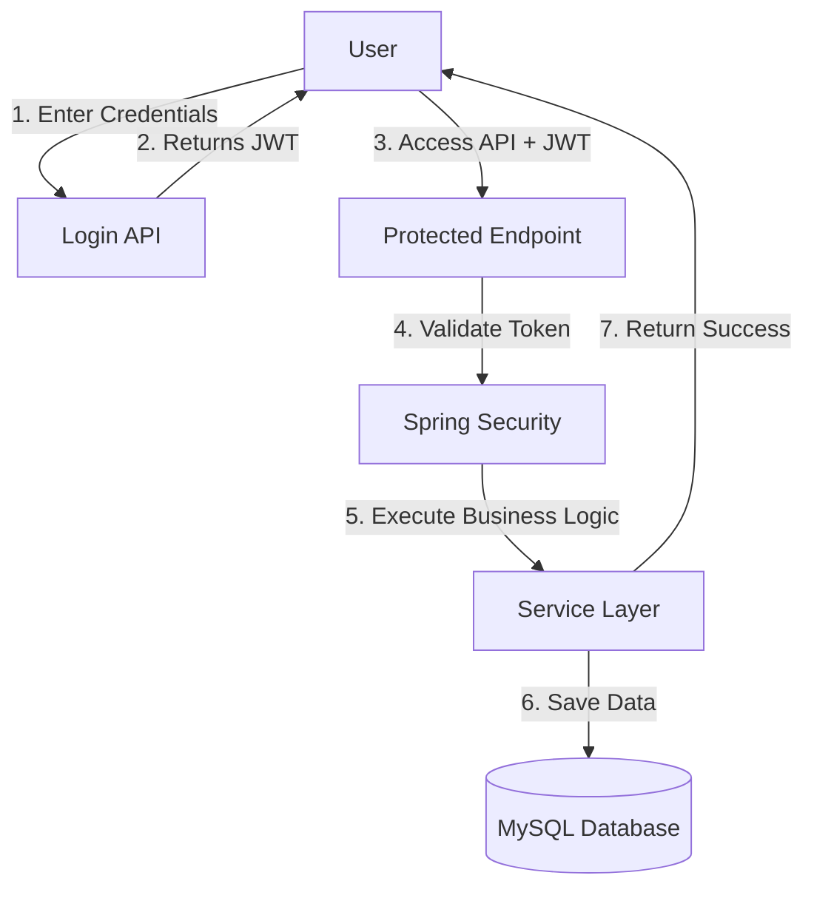

# JourneyPlus - Software Requirements Document (SRD)

## 1. Document Information

* **Document Title**: Software Requirements Document (SRD)
* **Project Name**: JourneyPlus - Corporate Travel and Expense Management Backend
* **Version**: 1.0.0
* **Author**: Software & Solution Architect
* **Date**: June 29, 2026
* **Purpose of the Document**: This document outlines the functional, non-functional, and system requirements of the JourneyPlus backend application. It serves as a guide for development, testing, and evaluation.

---

## 2. Table of Contents
1. [Document Information](#1-document-information)
2. [Table of Contents](#2-table-of-contents)
3. [Introduction](#3-introduction)
4. [Project Overview](#4-project-overview)
5. [Objectives](#5-objectives)
6. [Scope of the Project](#6-scope-of-the-project)
7. [User Roles](#7-user-roles)
8. [Functional Requirements](#8-functional-requirements)
9. [Non-Functional Requirements](#9-non-functional-requirements)
10. [System Requirements](#10-system-requirements)
11. [Technology Stack](#11-technology-stack)
12. [Module Description](#12-module-description)
13. [Business Rules](#13-business-rules)
14. [Assumptions](#14-assumptions)
15. [Limitations](#15-limitations)
16. [Use Cases](#16-use-cases)
17. [Simple Workflow](#17-simple-workflow)
18. [Expected Outcome](#18-expected-outcome)
19. [Conclusion](#19-conclusion)

---

## 3. Introduction

### What is the project?
* **JourneyPlus** is a backend system for corporate travel and expense management.
* It allows employees to request trips, request cash advances, and submit expense receipts.
* It helps managers and finance executives review and approve these requests.

### Why was this project developed?
* In many organizations, travel requests, approvals, and expense reimbursements are handled manually.
* This manual process is slow, leads to data entry errors, and makes it difficult to enforce company policies.
* This project was developed to automate these tasks.

### What problem does it solve?
* **Delayed Approvals**: Speeds up the approval process for travel and cash requests.
* **Over-budget Claims**: Automatically blocks or flags expenses that exceed company-defined limits.
* **Manual Errors**: Replaces paper forms and spreadsheets with digital records.

### Who will use this system?
* **Employees**: To request trips, advances, and submit expense claims.
* **Approving Managers**: To review and approve employee requests.
* **Finance Executives**: To disburse cash advances and pay reimbursements.
* **Travel Administrators**: To set up company policies and city tiers.
* **Compliance Officers**: To review and resolve policy violations.

---

## 4. Project Overview

### Main Purpose
* To provide a secure and automated backend system for managing the complete lifecycle of corporate travel and expense reimbursements.

### Main Features
* **User Authentication**: Secure signup and login using asymmetric JWT tokens.
* **Trip Management**: Creating, submitting, and updating travel itineraries.
* **Policy Auditing**: Real-time checking of expense amounts against role-based limits and city daily allowance tiers.
* **Cash Advance Processing**: Requesting, approving, and settling cash advances against trips.
* **Expense Reimbursement**: Converting foreign currencies, adjusting advances, and processing payments.
* **System Auditing**: Automatic logging of user operations for security.

### Expected Benefits
* Faster reimbursement cycles.
* Zero policy violations.
* Secure and encrypted storage of financial data.
* Transparent audit logs.

---

## 5. Objectives

* **Reduce Manual Work**: Automate the submission and approval of travel documents.
* **Improve Travel Management**: Track multi-leg itineraries and visa requirements in one place.
* **Automate Approval Workflows**: Route requests to designated managers and finance executives.
* **Enforce Compliance**: Check expense limits automatically.
* **Secure Financial Data**: Encrypt transaction amounts in the database.
* **Provide Audit Trails**: Record all important operations for administrative review.

---

## 6. Scope of the Project

### Included Features
* User registration and asymmetric RSA-signed JWT login.
* User account approval workflow for administrators and managers.
* Creating trip requests, adding itinerary legs, and tracking visa statuses.
* Creating cash advance requests and calculating settlement statuses.
* Creating expense claims, adding lines with receipt paths, and running compliance audits.
* Dynamic currency conversion to USD.
* Deducting cash advances from final expense reimbursements.
* Declarative logging of actions using AOP.
* Event-driven in-app notifications.

### Future Scope
* **Email & SMS Alerts**: Notify users about approvals or exceptions immediately.
* **Mobile Application**: Provide a mobile client for uploading receipts via camera.
* **Analytical Dashboard**: Show charts of monthly travel expenses and policy violations.
* **AI Receipt OCR**: Automatically extract amount, date, and merchant from uploaded receipt images.
* **Cloud Deployment**: Deploy the backend to AWS or Azure.

---

## 7. User Roles

| Role Name | Responsibilities | Permissions |
| :--- | :--- | :--- |
| **ROLE_EMPLOYEE** | Submits travel, advance, and expense requests. | Create trip/advance/expense, view own records, submit requests. |
| **ROLE_APPROVING_MANAGER** | Reviews and approves/rejects requests. | Approve/reject trips, advances, and expense claims for direct reports. |
| **ROLE_TRAVEL_ADMIN** | Manages policies and user activations. | Define policies and city tiers, approve pending user accounts, view audit logs. |
| **ROLE_FINANCE_EXECUTIVE** | Processes payments. | Disburse cash advances, record final expense reimbursements. |
| **ROLE_COMPLIANCE_OFFICER** | Reviews policy violations. | View and resolve policy exceptions flagged by the compliance engine. |

---

## 8. Functional Requirements

### User Management
* Users can register an account.
* Users can login using their username and password.
* Users can view their profile details.
* Admins can view pending accounts and approve/reject them.

### Authentication
* The system must authenticate users using JWT access tokens.
* Users can refresh expired access tokens using a valid refresh token.
* Passwords must be encrypted before saving.

### Travel Management
* Employees can create a draft trip request.
* Employees can add itinerary legs (origin, destination, cost, date) to a trip.
* Employees can add visa requirements for international trips.
* Employees can submit a trip request, which locks it from further editing.

### Policy Management
* Admins can define travel policies (maximum budget per trip) for different roles.
* Admins can define city tiers (daily allowance limit) for different cities.
* Anyone authenticated can view active policies and city tiers.

### Expense Management
* Employees can create an expense claim draft associated with a trip.
* Employees can add expense lines. The system must convert foreign currencies (INR, EUR, GBP, JPY, CAD) to USD.
* The compliance engine must audit every line against the travel policy and city daily allowance.
* If a line is non-compliant, the system must create a policy exception.
* The system must adjust outstanding cash advances and calculate the net reimbursable amount.

### Approval Workflow
* Managers can approve or reject trip requests, cash advances, and expense claims.
* Finance executives can disburse cash advances and pay reimbursements.

### Notification Module
* The system must generate notification records when a request status changes.
* Users can view their notifications and mark them as read.

### Audit Module
* The system must automatically log operations annotated with `@AuditAction`.
* Admins can view the audit logs.

---

## 9. Non-Functional Requirements

### Performance
* API response times should be under 200 milliseconds for standard operations.
* Currency conversion and compliance checks must execute instantly upon saving an expense line.

### Security
* Authentication must be stateless using asymmetric RSA JWT tokens.
* Passwords must be hashed using BCrypt.
* Sensitive database columns (amounts, allowances) must be encrypted using AES-256.

### Reliability
* The system must handle database transactions correctly. If an error occurs, changes must roll back.

### Scalability
* The backend must be stateless so multiple instances can run behind a load balancer.

### Maintainability
* Code must follow a layered structure so changes in one layer do not break others.

---

## 10. System Requirements

### Software Requirements
* **Java Development Kit (JDK)**: Version 21.
* **Framework**: Spring Boot 3.2.5.
* **Build Tool**: Maven 3.9+.
* **Database**: MySQL 8.0+.
* **API Testing**: Postman.
* **Documentation**: Swagger UI.

### Hardware Requirements
* **Processor**: Dual-core 2.0 GHz or higher.
* **RAM**: 4 GB minimum (8 GB recommended).
* **Storage**: 500 MB of free space for application files and logs.
* **Network**: Internet connection for dependency downloads and database connectivity.

---

## 11. Technology Stack

| Technology | Purpose | Why Used |
| :--- | :--- | :--- |
| **Java 21** | Programming Language | Long-Term Support version with modern features. |
| **Spring Boot 3.2.5** | Core Framework | Simplifies setup and manages application components. |
| **Spring MVC** | Web Layer | Helps build RESTful APIs. |
| **Spring Security** | Security | Secures endpoints and manages user roles. |
| **Spring Data JPA** | Data Access | Simplifies database queries using Java methods. |
| **Hibernate** | ORM | Maps Java classes to database tables. |
| **MySQL** | Database | Stores relational application data. |
| **Maven** | Build Tool | Manages project builds and dependencies. |
| **Swagger** | Documentation | Generates interactive API testing pages. |
| **Lombok** | Code Utility | Reduces getter/setter boilerplate code. |

---

## 12. Module Description

### 1. Authentication Module
* **Purpose**: Manages user access.
* **Main Features**: Registration, Login, Token Refresh.
* **Inputs**: Username, Password, Email, Role.
* **Outputs**: JWT Token, User Profile.

### 2. Travel Module
* **Purpose**: Manages trip itineraries.
* **Main Features**: Create Trip, Submit Trip, Add Leg, Track Visa.
* **Inputs**: Destination, Start/End Dates, Purpose, Cost.
* **Outputs**: Saved Trip Request, Itinerary Details.

### 3. Expense Module
* **Purpose**: Processes expense claims.
* **Main Features**: Create Claim, Add Line, Currency Conversion, Payout.
* **Inputs**: Category, Amount, Currency, Receipt.
* **Outputs**: Total Claim, Net Reimbursable, Reimbursement Record.

---

## 13. Business Rules

* Only authenticated users can access protected APIs.
* Users can only access features permitted by their assigned role.
* Passwords must be encrypted using BCrypt before saving.
* An employee can only request a cash advance against an **APPROVED** trip request.
* An employee can only request an advance for their own trip.
* Expense lines can only be added to claims in **DRAFT** status.
* If an expense line exceeds the policy limit or is missing a receipt, it is flagged as **NON_COMPLIANT**.
* Reimbursements can only be paid for **APPROVED** expense claims.

---

## 14. Assumptions

* Users have a reliable internet connection to access the APIs.
* The MySQL database server is running and accessible.
* The RSA public and private key files are placed in the correct resources folder.
* The system clock is accurate for generating correct JWT expiration times.

---

## 15. Limitations

* **No Mobile Client**: Currently, the system only provides a backend REST API.
* **Static Exchange Rates**: Currency conversion uses pre-seeded static rates rather than a real-time FX API.
* **No Offline Mode**: The system requires a continuous network connection to process requests.
* **Local Storage**: Uploaded files are stored on the local filesystem rather than a cloud storage service (like AWS S3).

---

## 16. Use Cases

| Use Case | Actor | Description |
| :--- | :--- | :--- |
| **Register User** | Employee / Manager | Creates a new account. Manager accounts require admin approval. |
| **Login** | All Users | Authenticates credentials and returns a JWT token. |
| **Create Travel Request** | Employee | Drafts a new trip request and adds travel legs. |
| **Approve Trip** | Approving Manager | Reviews and approves a submitted trip request. |
| **Request Cash Advance** | Employee | Requests funds for an approved trip. |
| **Submit Expense Claim** | Employee | Adds expense lines, runs compliance checks, and submits the claim. |
| **Pay Reimbursement** | Finance Executive | Processes the final payment for an approved claim. |
| **View Notifications** | All Users | Views status update alerts. |

---

## 17. Simple Workflow

Here is a simple workflow showing how an employee logs in and performs an action:

---

## 18. Expected Outcome

When successfully implemented, the system will:
* Securely register and authenticate users.
* Allow employees to submit travel itineraries and cash requests.
* Enforce budget compliance automatically and flag violations.
* Adjust cash advances and calculate correct reimbursement amounts.
* Provide administrators and compliance officers with clear audit logs and notifications.

---

## 19. Conclusion

**JourneyPlus** is a secure and reliable backend system for corporate travel and expense management. It automates manual workflows, enforces budget policies in real-time, and provides secure field-level encryption for financial data. By using Spring Boot, Hibernate, and Spring Security, it delivers a clean, layered architecture that is easy to maintain, test, and scale.
